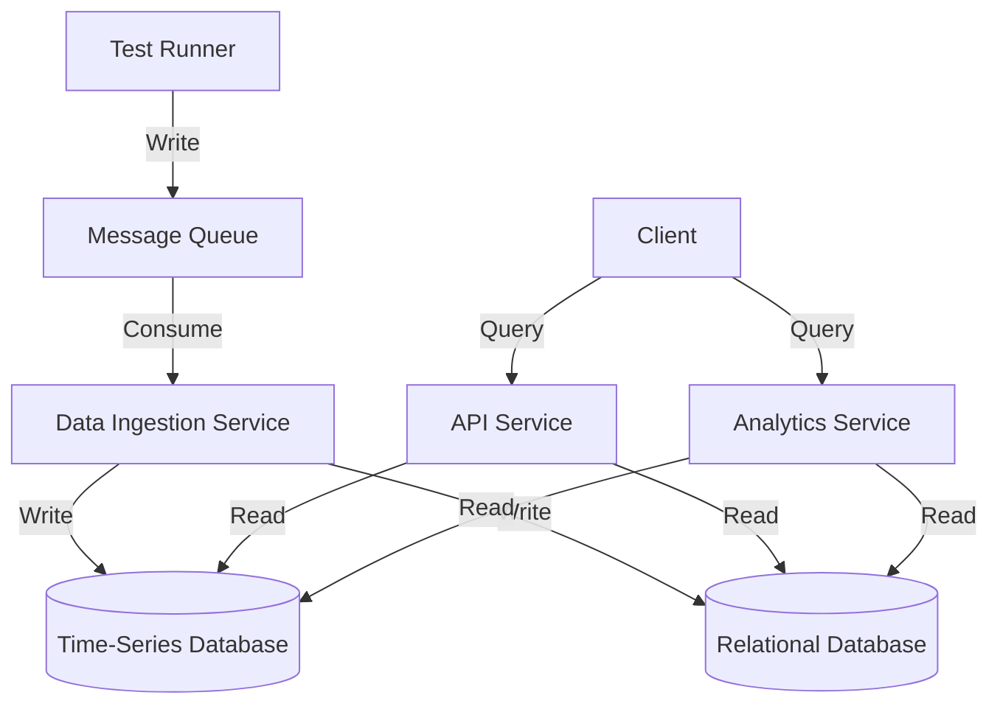
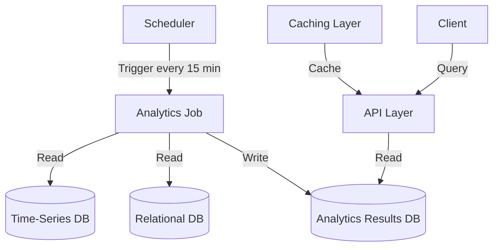

# Conceptual Design

```mermaid
graph TD
    A[Test Runner] -->|Write| B[Message Queue]
    B -->|Consume| C[Data Ingestion Service]
    C -->|Write| D[(Time-Series Database)]
    C -->|Write| E[(Relational Database)]
    F[API Service] -->|Read| D
    F -->|Read| E
    G[Analytics Service] -->|Read| D
    G -->|Read| E
    H[Client] -->|Query| F
    H -->|Query| G
```

# Musings on  Analytics

```mermaid
graph TD
    A[Scheduler] -->|Trigger every 15 min| B[Analytics Job]
    B -->|Read| C[(Time-Series DB)]
    B -->|Read| D[(Relational DB)]
    B -->|Write| E[(Analytics Results DB)]
    F[API Layer] -->|Read| E
    G[Caching Layer] -->|Cache| F
    H[Client] -->|Query| F
```